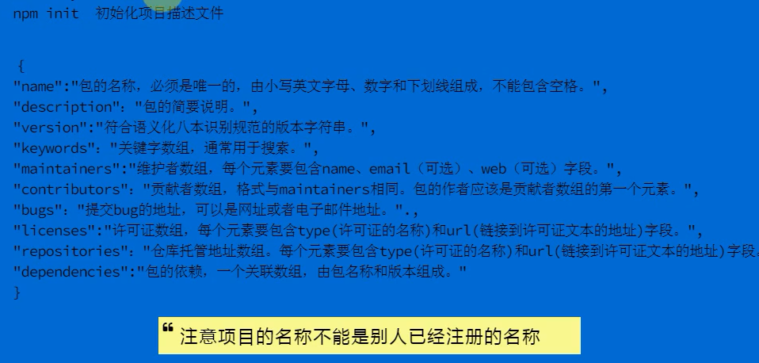
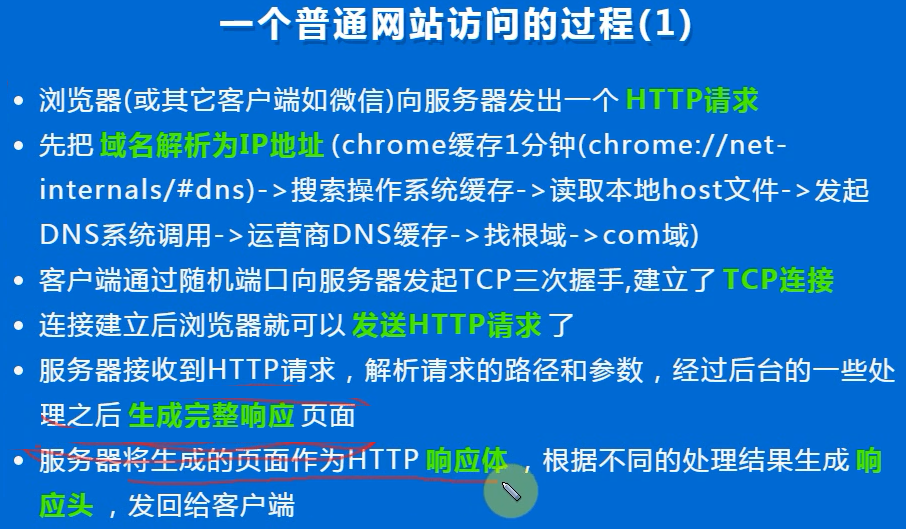

## REPL
Read -eval -print-loop 读取-求值-输出 循环

1. 使用 _ 可引用上次求值的返回值

```
> 1+1
2
> _+100
102
```

2. 基本用法
> .help

输出：
.break    Sometimes you get stuck, this gets you out
.clear    Alias for .break
.editor   Enter editor mode
.exit     Exit the repl
.help     Print this help message
.load     Load JS from a file into the REPL session  //可用于保存REPL输入的内容
.save     Save all evaluated commands in this REPL session to a file


## 模块

1.核心模块，如http、fs、path等
2.文件模块， 如 var math = require("./math");

```
math.js  --- math 模块
---------
var add = function (a,b){
    return a+b ;
};
var name = "qq";
exports.add = add;
exports.name = name;

test1.js
---------
var math = require("./math"); // 引入模块

console.log(math.add(100,200)); //300
console.log(math.name); //qq
```

3.第三方模块，如 var async = require("async");


### 初始化项目



### 安装

全局安装：下载模块到Node安装目录，各个项目均可调用
npm install -g package

本地安装 ：下载模块到当前目录的node_modules子目录，只有当前目录和它的子目录，才可以调用该模块
npm install package

### 网站访问流程




### URL组成


常用对照表：
tool.oschina.net/commons


### fs文件模块

1. readFileSync 同步读取文件，返回字符串
var text = fs.readFileSync(fileName,"utf-8");

2. readFile 异步读取文件
fs.readFil(fileName,"utf-8"，function(err,text){});


### global
nodejs中 global 类似于浏览器中的 window；
nodejs中this 一般指向模块的exports ，并非像浏览器中默认指向window