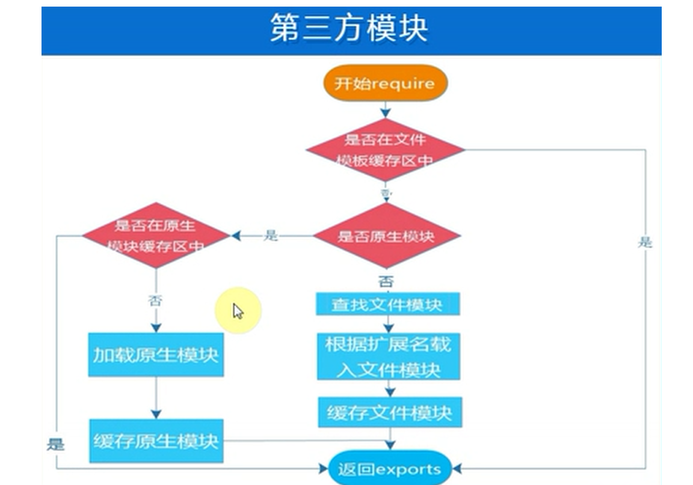
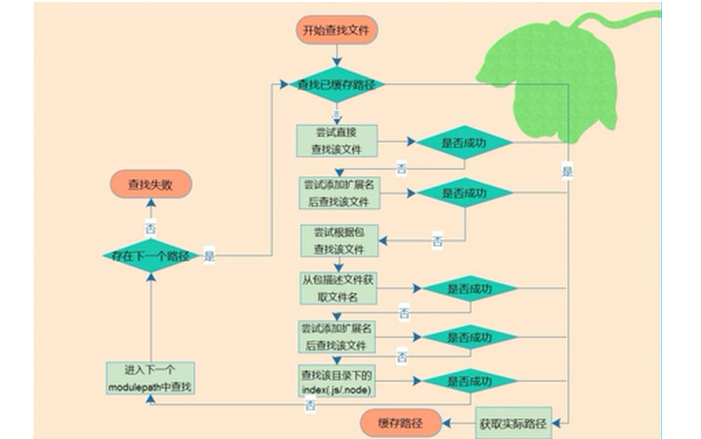

# Nodejs 模块
Node 应用由模块组成，采用 CommonJS 模块规范。
**每个文件就是一个模块，有自己的作用域。在一个文件里面定义的变量、函数、类，都是私有的**，对其他文件不可见。

如果想在多个文件分享变量，必须定义为global对象的属性。
global.warning = true;
代码中的warning变量，可以被所有文件读取。当然，这样写法是**不推荐**的。

## 1 CommonJS 规范


1. 在CommonJS规范规范下，__每个.js文件都是一个模块__，它们内部各自使用的变量名和函数名都互不冲突，
    例如，hello.js和main.js都申明了全局变量var s = 'xxx'，但互不影响。

2. 一个模块想要对外暴露变量（函数也是变量），可以用module.exports = variable;，
   一个模块要引用其他模块暴露的变量，用var ref = require('module_name');就拿到了引用模块的变量

3. 每个模块内部，module变量代表当前模块。这个变量是一个对象，它的exports属性（即module.exports）是对外的接口。加载某个模块，其实是加载该模块的module.exports属性。
   exports.foo = function () { return 'foo'; };
      exports.bar = function () { return 'bar'; };

      也可以写：
      module.exports.foo = function () { return 'foo'; };
      module.exports.bar = function () { return 'bar'; };

      或者
      module.exports = {
       foo：function () { return 'foo'; };
       bar：function () { return 'bar'; };
       }

4. CommonJS模块的特点
- 所有代码都运行在模块作用域，不会污染全局作用域。
- 模块可以多次加载，但是**只会在第一次加载时运行一次，然后运行结果就被缓存**了，以后再加载，就直接读取缓存结果。要想让模块再次运行，必须清除缓存。
- 模块加载的顺序，按照其在代码中出现的顺序。


5. AMD规范与CommonJS规范的兼容性

CommonJS规范加载模块是**同步的**，也就是说，只有加载完成，才能执行后面的操作。**AMD规范则是非同步加载模块**，允许指定回调函数。
由于Node.js主要用于服务器编程，模块文件一般都已经存在于本地硬盘，所以加载起来比较快，不用考虑非同步加载的方式，所以CommonJS规范比较适用。
但是，如果是浏览器环境，要从服务器端加载模块，这时就必须采用非同步模式，因此浏览器端一般采用AMD规范。

AMD规范使用define方法定义模块:

```
define(['package/lib'], function(lib){
  function foo(){
    lib.log('hello world!');
  }

  return {
    foo: foo
  };
});
```

AMD规范允许输出的模块兼容CommonJS规范:

```
define(function (require, exports, module){
  var someModule = require("someModule");
  var anotherModule = require("anotherModule");

  someModule.doTehAwesome();
  anotherModule.doMoarAwesome();

  exports.asplode = function (){
    someModule.doTehAwesome();
    anotherModule.doMoarAwesome();
  };
});
```


## 2 module对象

Node内部提供一个Module构建函数。**所有模块都是Module的实例**。

```
function Module(id, parent) {
  this.id = id;
  this.exports = {};
  this.parent = parent;
  // ...
```

每个模块内部，都有一个module对象，代表当前模块。它有以下属性:

- module.id 模块的识别符，通常是带有绝对路径的模块文件名。
- module.filename 模块的文件名，带有绝对路径。
- module.loaded 返回一个布尔值，表示模块是否已经完成加载。
- module.parent 返回一个对象，表示调用该模块的模块。
- module.children 返回一个数组，表示该模块要用到的其他模块。
- module.exports 表示模块对外输出的值。
- module.paths 模块的查找路


### 2.1 module.exports 属性和 exports变量

1. module.exports 属性
module.exports属性表示当前模块**对外输出的接口**，其他文件加载该模块，实际上就是读取module.exports变量。
参见demo1

```
// test1.js 文件 -------引入math.js、person1.js
var math = require("./math");
var person = require("./person1");
console.log(math.add(100,200)); //300
console.log(math.name); //math

console.log(person); //{ name: 'aa' }


// person1.js 文件
exports.name = "aa";

//module.exports.name = "aa";  // 和上句 exports.name = "aa"; 效果一样
// module.exports  = "bb"; // 如果这样写，上句 exports.name = "aa" 无效，因为module.exports被重新赋值

// math.js 文件
var add = function (a,b){
    return a+b ;
};
var name = "math";
exports.add = add;
exports.name = name;
```
2. exports变量
为了方便，Node为每个模块提供一个exports变量，指向module.exports。这等同在每个模块头部，有一行这样的命令。

```
var exports = module.exports;
```

**注意，不能直接将exports变量指向一个值，因为这样等于切断了exports与module.exports的联系**。

```
exports = function(x) {console.log(x)};
```

下面的写法也是无效的:

```
exports.hello = function() {
  return 'hello';
};

module.exports = 'Hello world';
// hello函数是无法对外输出的，因为module.exports被重新赋值
```


### 2.2 module 其他属性

详见demo2, module信息如下：

```
Module {
    id: 'F:\\notes\\node\\node_learning\\ch2模块-module\\demo2\\math2.js',
        exports: {},
    parent:
        Module {
        id: '.',
            exports: {},
            parent: null,
            filename: 'F:\\notes\\node\\node_learning\\ch2模块-module\\demo2\\test2.js'
            ,
            loaded: false,
            children: [ [Circular] ],
            paths:
        [ 'F:\\notes\\node\\node_learning\\ch2模块-module\\demo2\\node_modules',
            'F:\\notes\\node\\node_learning\\ch2模块-module\\node_modules',
            'F:\\notes\\node\\node_learning\\node_modules',
            'F:\\notes\\node\\node_modules',
            'F:\\notes\\node_modules',
            'F:\\node_modules' ] },
    filename: 'F:\\notes\\node\\node_learning\\ch2模块-module\\demo2\\math2.js',
   loaded: false,
   children:
        [ Module {
            id: 'F:\\notes\\node\\node_learning\\ch2模块-module\\demo2\\person2.js',
            exports: [Object],
            parent: [Circular],
            filename: 'F:\\notes\\node\\node_learning\\ch2模块-module\\demo2\\person2
                .js',
            loaded: true,
            children: [],
            paths: [Array] } ],
    paths:
        [ 'F:\\notes\\node\\node_learning\\ch2模块-module\\demo2\\node_modules',
            'F:\\notes\\node\\node_learning\\ch2模块-module\\node_modules',
            'F:\\notes\\node\\node_learning\\node_modules',
            'F:\\notes\\node\\node_modules',
            'F:\\notes\\node_modules',
            'F:\\node_modules' ] }

```


## 3 require命令

Node使用CommonJS模块规范，内置的require命令用于加载模块文件。
require命令的基本功能是，读入并执行一个JavaScript文件，然后返回该模块的exports对象。如果没有发现指定模块，会报错。
- 1.Node.js的模块分为两类，**一类为核心模块（node提供，即原生模块），一类为文件模块（用户编写）**。
- 2.核心模块在Node.js源代码编译的时候编译进了二进制执行文件，在nodejs启动过程中，部分核心模块直接加载进了内存中，所以这部分模块引入时可以省略文件定位和编译执行两个步骤，所以加载的速度最快。
- 3.另一类文件模块是动态加载的，加载速度比核心模块慢。
- 4.Node.js对**核心模块和文件模块都进行了缓存，于是在第二次require时，是不会有重复开销的**。其中原生模块都被定义在lib这个目录下面，文件模块则不定性。
- 5.文件模块中，又分为 3 类模块。这三类文件模块以后缀来区分，Node.js 会根据后缀名来决定加载方法。
  > .js。通过 fs 模块同步读取 js 文件并编译执行。
  > .node。通过 C/C++ 进行编写的 Addon。通过 dlopen 方法进行加载。
  > .json。读取文件，调用 JSON.parse 解析加载。

### 3.1 加载规则
 require命令用于加载文件，后缀名默认为.js。
 模块加载可分为 原生模块加载 和 文件模块加载 2大类。

注释：通过process.moduleLoadList可以查看已经加载的核心模块。

#### 3.1.1 require 方法接受以下几种参数的传递：

- http、fs、path 等，原生模块。
- ./mod 或../mod，相对路径的文件模块。
- /pathtomodule/mod，绝对路径的文件模块。
- mod，非原生模块的文件模块。

#### 3.1.2 流程
当 Node 遇到 require(X) 时，按下面的顺序处理（以下顺序中未额外说明缓存的情形，node加载原生和文件模块均会先查找缓存）。

（1）如果 X 是原生模块（比如 require('http'）)
　　a. 返回该模块。
　　b. 不再继续执行。

（2）如果 X 以 "./" 或者 "/" 或者 "../" 开头
　　a. 根据 X 所在的父模块，确定 X 的绝对路径。
　　b. 将 X 当成文件，依次查找下面文件，只要其中有一个存在，就返回该文件，不再继续执行。

        ```
        X
        X.js
        X.json
        X.node
        ```
　　c. 将 X 当成目录，依次查找下面文件，只要其中有一个存在，就返回该文件，不再继续执行。

        ```
        X/package.json（main字段）
        X/index.js
        X/index.json
        X/index.node
        ```

（3）如果 X 不带路径
　　a. 根据 X 所在的父模块，确定 X 可能的安装目录。
　　b. 依次在每个目录中，将 X 当成文件名或目录名加载。

（4） 抛出 "not found"


```
当前脚本文件 /home/ry/projects/foo.js 执行了 require('bar') ，这属于上面的第三种情况。Node 内部运行过程如下。

首先，确定 x 的绝对路径可能是下面这些位置，依次搜索每一个目录。

/home/ry/projects/node_modules/bar
/home/ry/node_modules/bar
/home/node_modules/bar
/node_modules/bar

搜索时，Node 先将 bar 当成文件名，依次尝试加载下面这些文件，只要有一个成功就返回。

bar
bar.js
bar.json
bar.node

如果都不成功，说明 bar 可能是目录名，于是依次尝试加载下面这些文件。

bar/package.json（main字段）
bar/index.js
bar/index.json
bar/index.node
如果在所有目录中，都无法找到 bar 对应的文件或目录，就抛出一个错误


```


#### 3.1.3 原生模块加载

**原生模块的优先级仅次于文件模块缓存的优先级**。require 方法在解析文件名之后，优先检查模块是否在原生模块列表中。
以 http 模块为例，尽管在目录下存在一个 http/http.js/http.node/http.json 文件，require(“http”) 都不会从这些文件中加载，而是从原生模块中加载。


#### 3.1.4 文件模块加载

文件模块加载过程如下图：



### 3.2 require的属性和方法
- main 主模块
- resolve 得到实际查找结果路径
- cache 模块缓存
- delete cache 删除缓存


