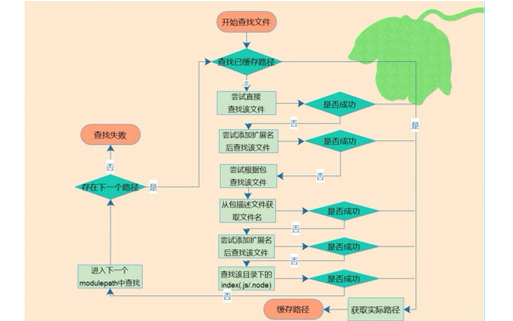

# nodejs_notes

### CommonJS规范
   1. node.js模块加载机制被称为CommonJS规范。在这个规范下，__每个.js文件都是一个模块__，它们内部各自使用的变量名和函数名都互不冲突，
    例如，hello.js和main.js都申明了全局变量var s = 'xxx'，但互不影响。

   2. 一个模块想要对外暴露变量（函数也是变量），可以用module.exports = variable;，
   一个模块要引用其他模块暴露的变量，用var ref = require('module_name');就拿到了引用模块的变量

   3. exports.foo = function () { return 'foo'; };
      exports.bar = function () { return 'bar'; };

      也可以写：
      module.exports.foo = function () { return 'foo'; };
      module.exports.bar = function () { return 'bar'; };

      或者
      module.exports = {
       foo：function () { return 'foo'; };
       bar：function () { return 'bar'; };
       }


示例2：

hello2.js

```
"use strict";
function hello(){
    console.log("hello");
}

function greet(name){
    console.log("greet to: "+name);
}

/*module.exports = {
    hello:hello,
    greet:greet
}*/

/*
module.exports.hello = hello;
module.exports.greet = greet; */
/**/
exports.hello = hello;
exports.greet = greet;
 


//错误的写法，为导出任何变量
/*
exports = {
	hello:hello,
    greet:greet
}*/

```

main2.js

```
"use strict";
var hello2 = require("./hello2");

hello2.hello();
hello2.greet("test22222");

var data2 = require("./data.json");
console.log(typeof data2);
console.log(data2);
```


### 可以使用以下方式加载和使用一个JSON文件

var data = require('./data.json');

## 模块

1.核心模块，如http、fs、path等
2.文件模块， 如 var math = require("./math");

```
math1.js  --- math 模块
---------
var add = function (a,b){
    return a+b ;
};
var name = "qq";
exports.add = add;
exports.name = name;

test1.js
---------
var math = require("./math"); // 引入模块

console.log(math.add(100,200)); //300
console.log(math.name); //qq
```

3.第三方模块，如 var async = require("async");

### 模块加载

  如果只写模块名：
      var greet = require('hello');
      则Node会依次在 __内置模块__、 __全局模块__ 和 __当前模块__ 下查找hello.js

	     linux下：
		/home/user/node_modules/foo/bar   // 内置模块--windows下取决于安装目录（环境变量path）
		/home/node_modules/foo/bar        // 全局模块 --windows下如C:\Users\user\node_modules
		/node_modules/foo/bar             // 当前模块




文件加载路径如下例：
```
/*var home_1 = require("./home_1");
console.log(home_1.home); //china
console.log(module.paths); */

/*
[ 'f:\\notes\\node\\node_learning1\\ch3module\\demo4-加载路径\\node_modules',
    'f:\\notes\\node\\node_learning1\\ch3module\\node_modules',
    'f:\\notes\\node\\node_learning1\\node_modules',
    'f:\\notes\\node\\node_modules',
    'f:\\notes\\node_modules',
    'f:\\node_modules' ]*/

```

如 文件模块加载.png  所示，查找过程中如果未查找到文件，会将其作为包进行查找

创建包
  node_modules
     |---- home3
            |--- home3.js
            |--- index.js
            |--- package.json

package.json       ---main 属性默认为 index.js
```
{
  "name": "init_test",
  "version": "1.0.0",
  "description": "test",
  "main": "home3.js",
  "scripts": {
    "test": "echo \"Error: no test specified\" && exit 1"
  },
  "author": "",
  "license": "ISC"
}

```

```
 delete require.cache[require.resolve("home_2.js")];
 var home_2 = require("home_2.js");
 console.log(home_2.home); //china22

var home3 = require("home3");  // 创建包，进行测试
console.log(home3.home3); //china33
```

